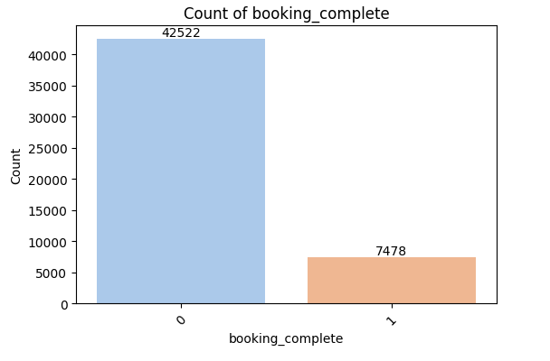
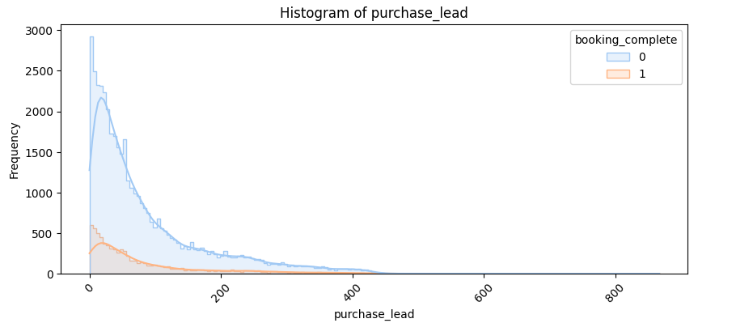
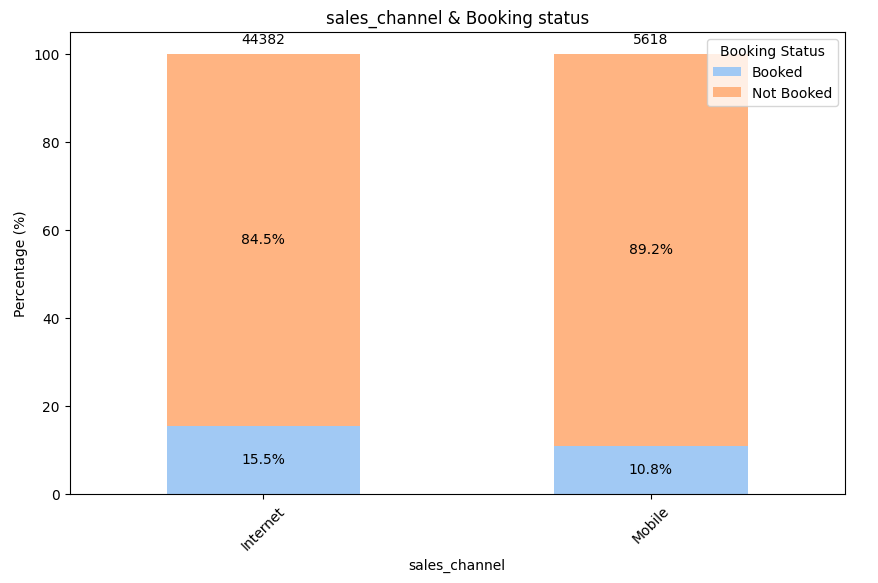
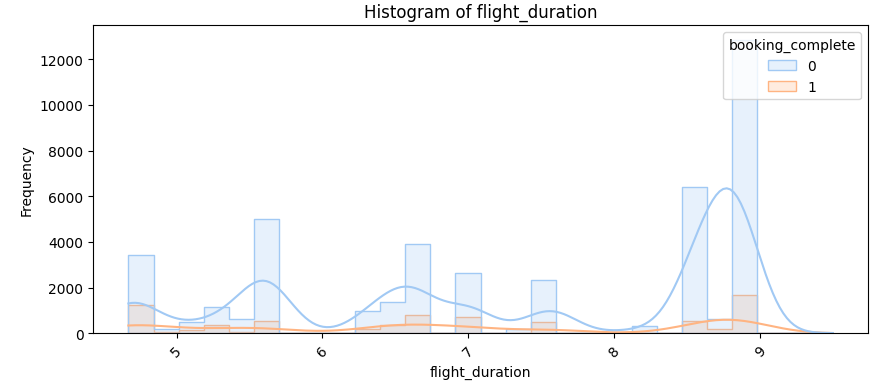
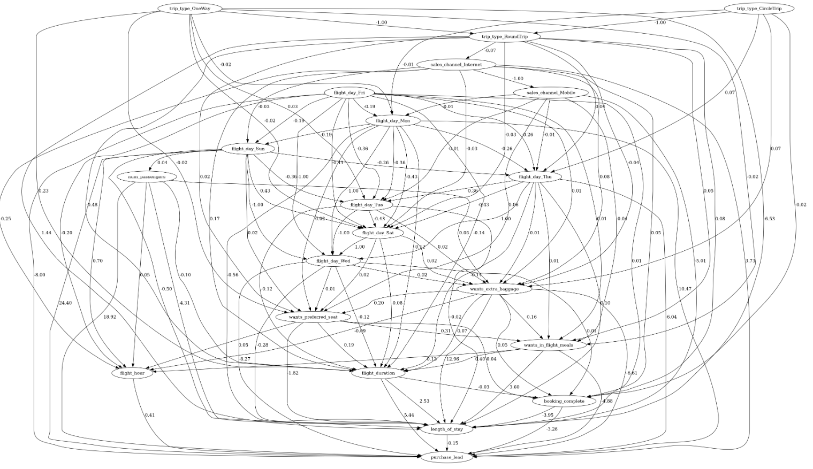
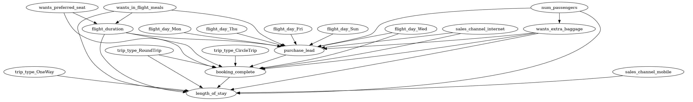

# Causal Analysis of Airline Dataset

## Overview

This repository contains a comprehensive analysis of an Airline Dataset to understand the factors influencing booking completion rates. The analysis includes Exploratory Data Analysis (EDA), Data Visualization, and Causal Discovery techniques to identify potential causal relationships.

## Project Structure

- **EDA and Data Visualization**: Initial exploration of the dataset to understand the distribution, trends, and patterns within the data. This step involves summarizing statistics and creating visualizations to gain insights.
  

  

  

  
  
- **Causal Discovery Using Lingam**: Leveraging the Lingam (Linear Non-Gaussian Acyclic Model) algorithm to uncover potential causal relationships within the data.
  
  
- **Custom DAG Creation**: Based on domain knowledge, a custom Directed Acyclic Graph (DAG) was created to hypothesize causal relationships.
  
  
- **Treatment Identification and Analysis**: Identifying a specific treatment to analyze its impact on booking completion rates. The goal is to determine if interventions can lead to improved booking completions.

  1. **SCM (Structural Causal Model)**:
     Structural Causal Models provide a formal framework for representing and reasoning about causal relationships. In this project, SCMs were used to encode our domain knowledge about the airline dataset, specifying how different variables are causally related. By using SCMs, we could define structural equations that represent these relationships and use them to simulate potential outcomes under different treatment scenarios. This approach helped us understand the direct and indirect effects of various factors on booking completion rates.
     
  2. **Doubly Robust Estimation**:
     Doubly Robust Estimation (DRE) combines Outcome Regression (OR) and Propensity Score Weighting (PSW) to provide a more reliable estimate of the treatment effect. The estimator remains consistent if either the outcome regression model or the propensity score model is correctly specified, offering increased reliability and precision in causal inference.

     **Intuition Behind Doubly Robust Estimation**:
     In the context of causal analysis, identifying the effect of a treatment on an outcome can be challenging due to potential confounding variables. DRE leverages both OR and PSW to provide a more reliable estimate of the treatment effect. The key advantage of DRE is its "double robustness": the estimator remains consistent if either the outcome regression model or the propensity score model is correctly specified. In other words, even if one of the models is misspecified, the estimator can still provide valid estimates of the treatment effect.

     - **Outcome Regression (OR)**: This approach models the outcome directly as a function of the treatment and covariates, helping to predict the outcome under different treatment scenarios by controlling for confounding variables.
     - **Propensity Score Weighting (PSW)**: This approach models the probability of receiving the treatment given the covariates (propensity score), helping to create a pseudo-population where the treatment assignment is independent of the covariates, mimicking a randomized experiment.

     **Why Use Doubly Robust Estimation?**
     - **Increased Reliability**: By combining two approaches, DRE offers a safeguard against model misspecification, enhancing the robustness of the causal inference.
     - **Flexibility**: It can handle complex data structures and relationships between covariates, treatment, and outcome.
     - **Improved Precision**: In practice, DRE often results in more precise estimates compared to using only OR or PSW.

     In this project, Doubly Robust Estimation was used to identify and analyze the impact of a specific treatment on booking completion rates, ensuring robust and reliable causal estimates.
